# MediPal - Cute Medicine Tracker

MediPal is an Expo (React Native) app that helps you track medicines with a soft mint UI, friendly avatars, and local reminders.

## Features

- Add / edit medicines: name, dosage amount + unit (pill/tablet/capsule/ml/unit/drop), times per day, duration (preset or custom days), color tag, reminders toggle, snooze.
- Reminder times: per-dose time pickers; validates count matches "times per day"; optional snooze frequency; stores in AsyncStorage via Context API.
- Remaining pills: auto-calculates total and remaining for pill/tablet/capsule units; updates when "Done" action is tapped on a notification.
- Notifications: scheduled by hour/minute with action buttons (Done, Remind me later); per-medicine cancel/reschedule when reminders are off or times change.
- Theming: light and dark modes with persistence; themed tab bar and cards.
- Navigation: bottom tabs (Home, Add, Account) plus Account stack for profile and appearance.
- Profile: username/email fields, avatar picker (grid of uploaded avatars), save profile, change password UI, logout clears local session.

## Installation & Run

1. Clone the repo (first step)

```bash
git clone <repo-url>
cd Mobileapp    # or your folder name
```

2. Install dependencies

```bash
npm install
```

3. Start in Expo Go (development)

```bash
npx expo start
```

- Scan the QR code with Expo Go on your device. Accept notification permission prompts.
- For reliable scheduled notifications and action buttons, use a development build instead of Expo Go.

4. iOS/Android simulators (optional)

```bash
npm run ios    # requires Xcode + simulator
npm run android
```

## Screenshots

<table>
  <tr>
    <td>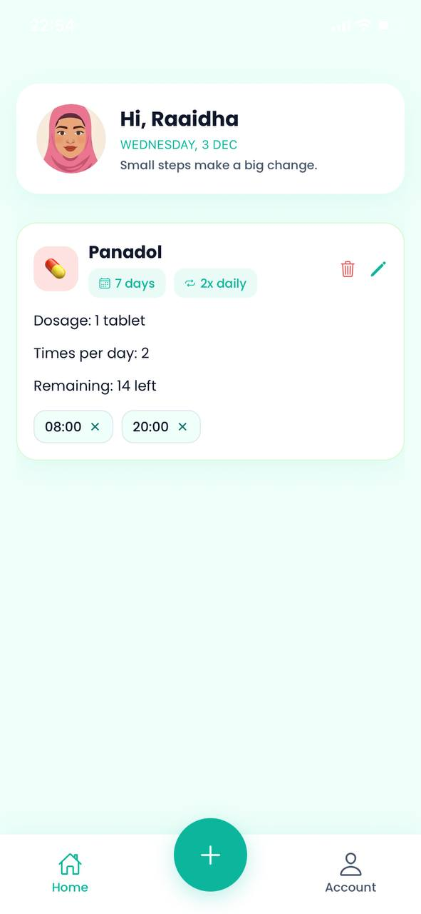<div>Home (light)</div></td>
    <td><div>Add Medicine (top)</div></td>
    <td>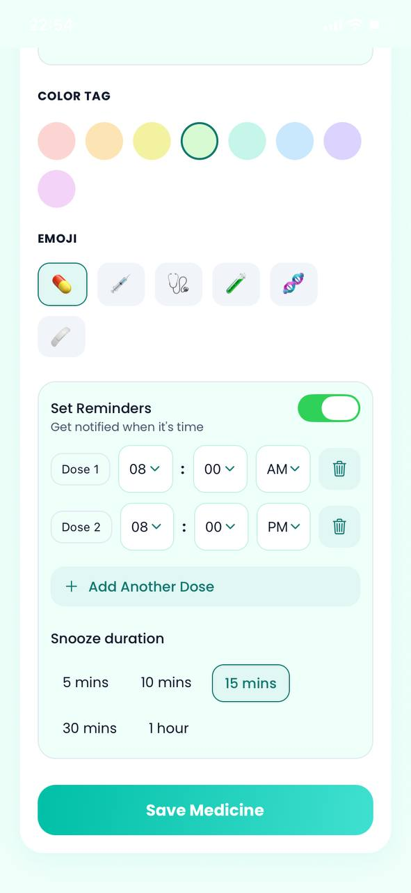<div>Add Medicine (reminders)</div></td>
    <td>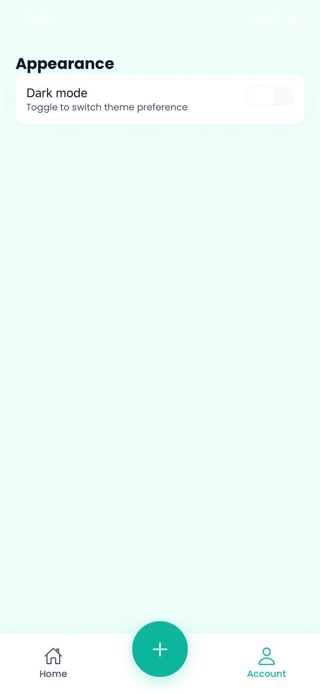<div>Appearance (light)</div></td>
  </tr>
  <tr>
    <td>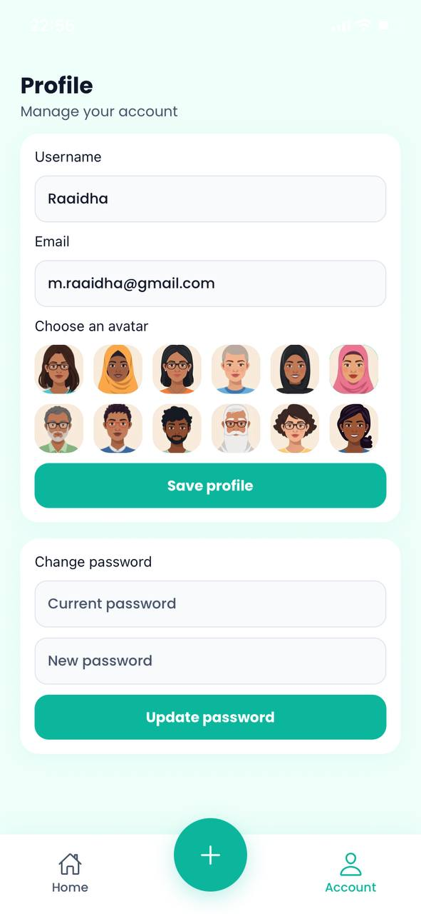<div>Profile (light)</div></td>
    <td><div>Account hub (light)</div></td>
    <td>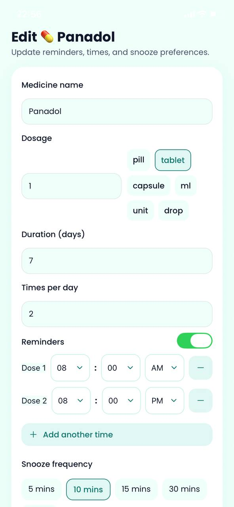<div>Edit Medicine (light)</div></td>
    <td>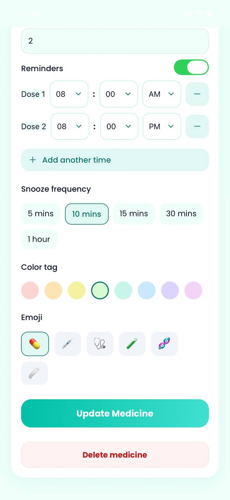<div>Edit detail</div></td>
  </tr>
  <tr>
    <td>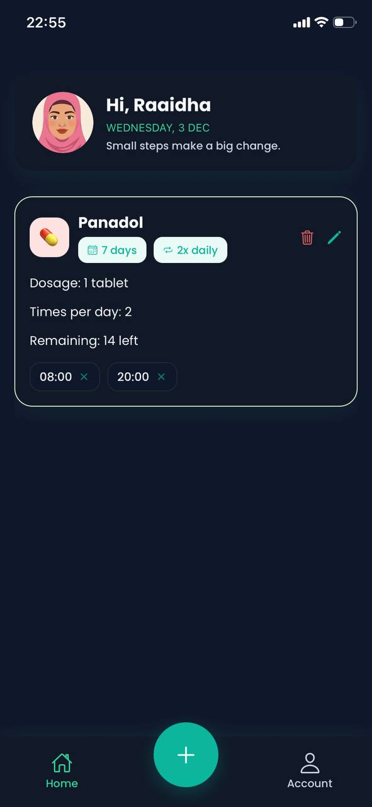<div>Edit (dark)</div></td>
    <td><div>Home (dark)</div></td>
    <td>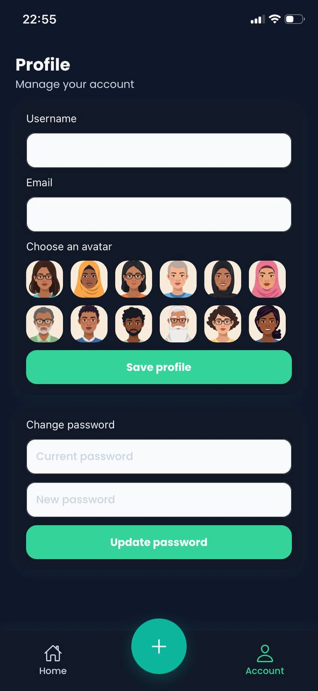<div>Home detail (dark)</div></td>
    <td>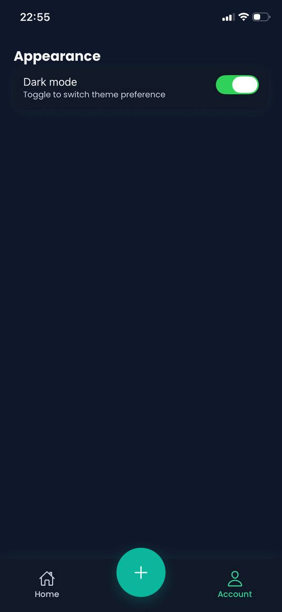<div>Medicine card (dark)</div></td>
  </tr>
  <tr>
    <td>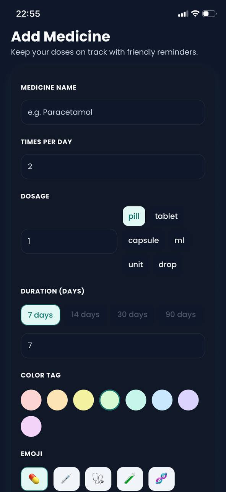<div>Medicine list (dark)</div></td>
    <td>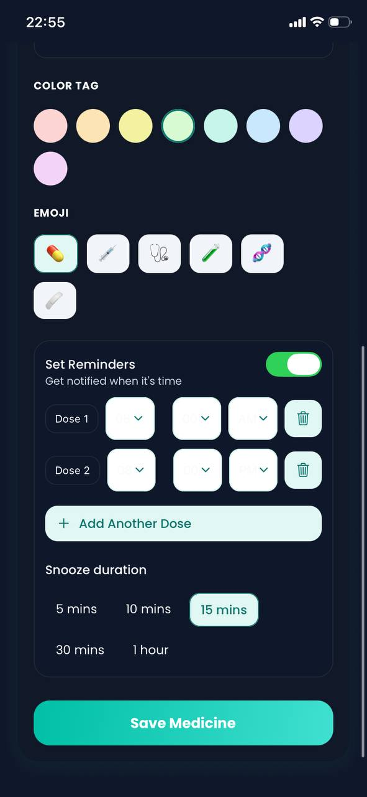<div>Account (dark)</div></td>
    <td>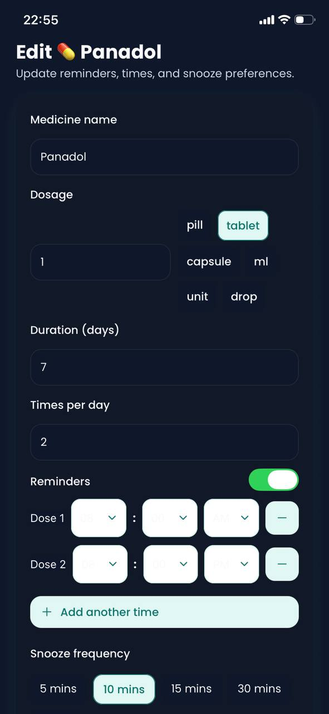<div>Profile (dark)</div></td>
    <td>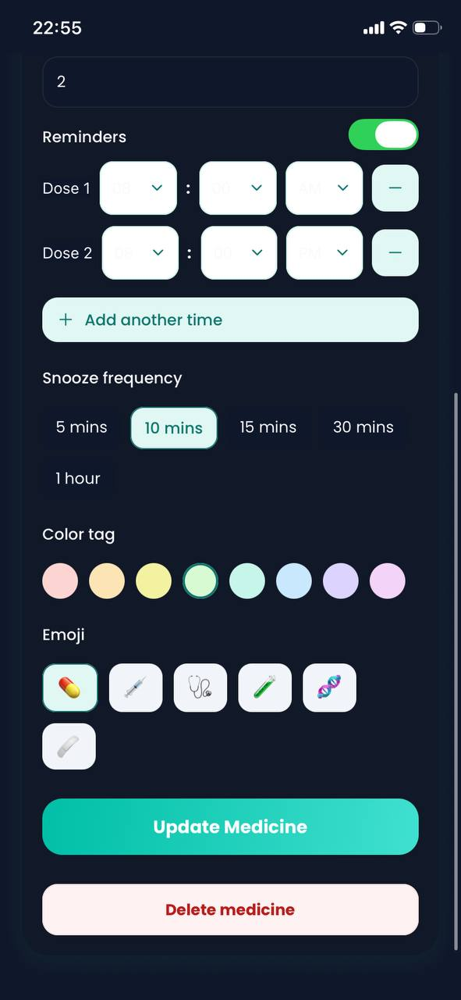<div>Card (dark)</div></td>
  </tr>
</table>

## Technologies Used

- Expo SDK 54, React Native, TypeScript
- Navigation: expo-router with bottom tabs
- State/persistence: Context API, @react-native-async-storage/async-storage
- Notifications: expo-notifications (local scheduled, action buttons)
- UI: @expo/vector-icons, react-native-gesture-handler, react-native-reanimated, react-native-safe-area-context

## Known Issues / Future Improvements

- Expo Go limits notifications: scheduled alarms and action buttons are unreliable in Expo Go; use a dev build (`eas build --profile development`) for accurate timing.
- Push notifications are not implemented; only local reminders are scheduled.
- No cloud sync; all data is local.
- Future ideas: server sync, richer adherence stats, backup/restore, optional email login.
